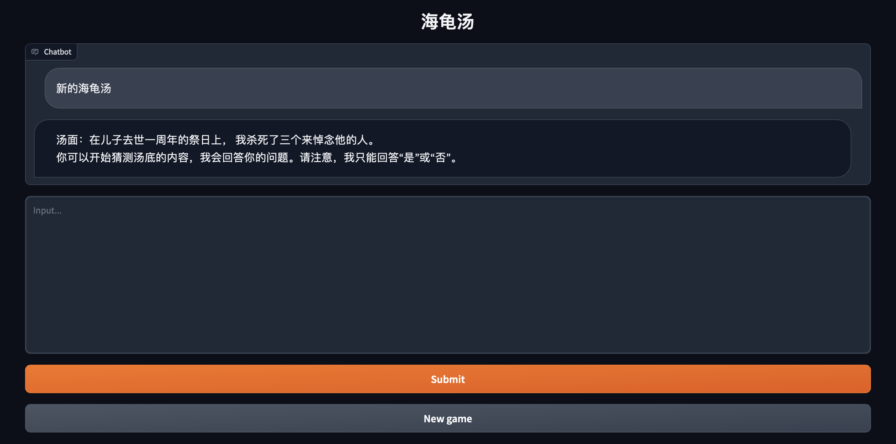
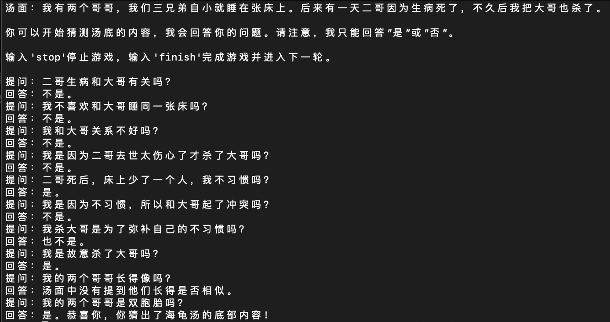

# ChatGLM-6B

<p align="center">
   🌐 <a href="https://chatglm.cn/blog" target="_blank">Blog</a> • 🤗 <a href="https://huggingface.co/THUDM/chatglm-6b" target="_blank">HF Repo</a> • 🐦 <a href="https://twitter.com/thukeg" target="_blank">Twitter</a> • 📃 <a href="https://arxiv.org/abs/2103.10360" target="_blank">[GLM@ACL 22]</a> <a href="https://github.com/THUDM/GLM" target="_blank">[GitHub]</a> • 📃 <a href="https://arxiv.org/abs/2210.02414" target="_blank">[GLM-130B@ICLR 23]</a> <a href="https://github.com/THUDM/GLM-130B" target="_blank">[GitHub]</a> <br>
</p>

## 介绍

ChatGLM-6B 是一个开源的、支持中英双语的对话语言模型，基于 [General Language Model (GLM)](https://github.com/THUDM/GLM) 架构，具有 62 亿参数。结合模型量化技术，用户可以在消费级的显卡上进行本地部署（INT4 量化级别下最低只需 6GB 显存）。
ChatGLM-6B 使用了和 ChatGPT 相似的技术，针对中文问答和对话进行了优化。经过约 1T 标识符的中英双语训练，辅以监督微调、反馈自助、人类反馈强化学习等技术的加持，62 亿参数的 ChatGLM-6B 已经能生成相当符合人类偏好的回答，更多信息请参考我们的[博客](https://chatglm.cn/blog)。

为了方便下游开发者针对自己的应用场景定制模型，我们同时实现了基于 [P-Tuning v2](https://github.com/THUDM/P-tuning-v2) 的高效参数微调方法 [(使用指南)](ptuning/README.md) ，INT4 量化级别下最低只需 7GB 显存即可启动微调。

不过，由于 ChatGLM-6B 的规模较小，目前已知其具有相当多的[**局限性**](#局限性)，如事实性/数学逻辑错误，可能生成有害/有偏见内容，较弱的上下文能力，自我认知混乱，以及对英文指示生成与中文指示完全矛盾的内容。请大家在使用前了解这些问题，以免产生误解。更大的基于 1300 亿参数 [GLM-130B](https://github.com/THUDM/GLM-130B) 的 ChatGLM 正在内测开发中。

*Read this in [English](README_en.md).*

## 友情链接
以下是部分基于本仓库开发的开源项目：
* [SwissArmyTransformer](https://github.com/THUDM/SwissArmyTransformer): 一个Transformer统一编程框架，ChatGLM-6B已经在SAT中进行实现并可以进行P-tuning微调。
* [ChatGLM-MNN](https://github.com/wangzhaode/ChatGLM-MNN): 一个基于 MNN 的 ChatGLM-6B C++ 推理实现，支持根据显存大小自动分配计算任务给 GPU 和 CPU
* [ChatGLM-Tuning](https://github.com/mymusise/ChatGLM-Tuning): 基于 LoRA 对 ChatGLM-6B 进行微调。类似的项目还包括 [Humanable ChatGLM/GPT Fine-tuning | ChatGLM 微调](https://github.com/hscspring/hcgf)
* [langchain-ChatGLM](https://github.com/imClumsyPanda/langchain-ChatGLM)：基于本地知识的 ChatGLM 应用，基于LangChain
* [bibliothecarius](https://github.com/coderabbit214/bibliothecarius)：快速构建服务以集成您的本地数据和AI模型，支持ChatGLM等本地化模型接入。
* [闻达](https://github.com/l15y/wenda)：大型语言模型调用平台，基于 ChatGLM-6B 实现了类 ChatPDF 功能
* [JittorLLMs](https://github.com/Jittor/JittorLLMs)：最低3G显存或者没有显卡都可运行 ChatGLM-6B FP16， 支持Linux、windows、Mac部署

以下是部分针对本项目的教程/文档：
* [Windows部署文档](https://github.com/ZhangErling/ChatGLM-6B/blob/main/deployment_windows.md)

如果你有其他好的项目/教程的话，欢迎参照上述格式添加到 README 中并提出 [Pull Request](https://docs.github.com/en/pull-requests/collaborating-with-pull-requests/proposing-changes-to-your-work-with-pull-requests/creating-a-pull-request-from-a-fork)。

## 游戏Demo

我们提供了一个基于 [Gradio](https://gradio.app) 的网页版 Demo 和一个命令行 Demo。使用时首先需要下载本仓库：

```shell
git clone https://github.com/THUDM/ChatGLM-6B
cd ChatGLM-6B
git checkout game
pip install -r requirements.txt
```

由于游戏效果演示是用gpt-3.5，所以使用前要在脚本中 `openai.api_key = "your-openai-api-key"` 填入自己的openai api key。运行脚本前需要在终端挂代理，Windows系统命令行代理：

```shell
set http_proxy=127.0.0.1:port
set https_proxy=127.0.0.1:port
```

Mac或Linux系统命令行代理：

```shell
export http_proxy=http://127.0.0.1:port
export https_proxy=http://127.0.0.1:port
```

### 网页版 Demo



首先安装 Gradio：`pip install gradio`，然后运行仓库中的 [web_demo_zh.py](web_demo_zh.py)或英文版 [web_demo_en.py](web_demo_en.py)： 

```shell
python web_demo_zh.py

python web_demo_en.py
```

程序会运行一个 Web Server，并输出地址。在浏览器中打开输出的地址即可使用。最新版 Demo 实现了打字机效果，速度体验大大提升。注意，由于国内 Gradio 的网络访问较为缓慢，启用 `demo.queue().launch(share=True, inbrowser=True)` 时所有网络会经过 Gradio 服务器转发，导致打字机体验大幅下降，现在默认启动方式已经改为 `share=False`，如有需要公网访问的需求，可以重新修改为 `share=True` 启动。

### 命令行 Demo



运行仓库中 [cli_demo_zh.py](cli_demo_zh.py)或英文版[cli_demo_en.py](cli_demo_en.py)：

```shell
python cli_demo_zh.py

python cli_demo_en.py
```

程序会在命令行中进行交互式的对话，在命令行中输入指示并回车即可生成回复，输入 `finish` 可以清空对话历史开始新游戏，输入 `stop` 终止程序。

## 协议

本仓库的代码依照 [Apache-2.0](LICENSE) 协议开源，ChatGLM-6B 模型的权重的使用则需要遵循 [Model License](MODEL_LICENSE)。

## 引用

如果你觉得我们的工作有帮助的话，请考虑引用下列论文

```
@inproceedings{
  zeng2023glm-130b,
  title={{GLM}-130B: An Open Bilingual Pre-trained Model},
  author={Aohan Zeng and Xiao Liu and Zhengxiao Du and Zihan Wang and Hanyu Lai and Ming Ding and Zhuoyi Yang and Yifan Xu and Wendi Zheng and Xiao Xia and Weng Lam Tam and Zixuan Ma and Yufei Xue and Jidong Zhai and Wenguang Chen and Zhiyuan Liu and Peng Zhang and Yuxiao Dong and Jie Tang},
  booktitle={The Eleventh International Conference on Learning Representations (ICLR)},
  year={2023},
  url={https://openreview.net/forum?id=-Aw0rrrPUF}
}
```
```
@inproceedings{du2022glm,
  title={GLM: General Language Model Pretraining with Autoregressive Blank Infilling},
  author={Du, Zhengxiao and Qian, Yujie and Liu, Xiao and Ding, Ming and Qiu, Jiezhong and Yang, Zhilin and Tang, Jie},
  booktitle={Proceedings of the 60th Annual Meeting of the Association for Computational Linguistics (Volume 1: Long Papers)},
  pages={320--335},
  year={2022}
}
```
